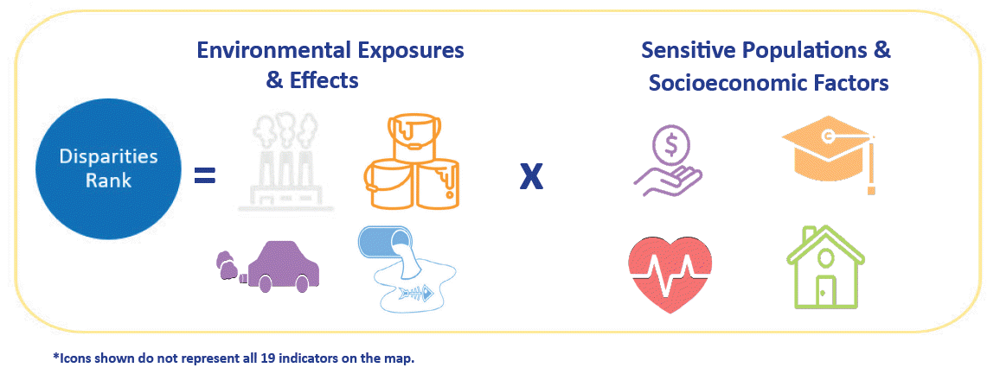
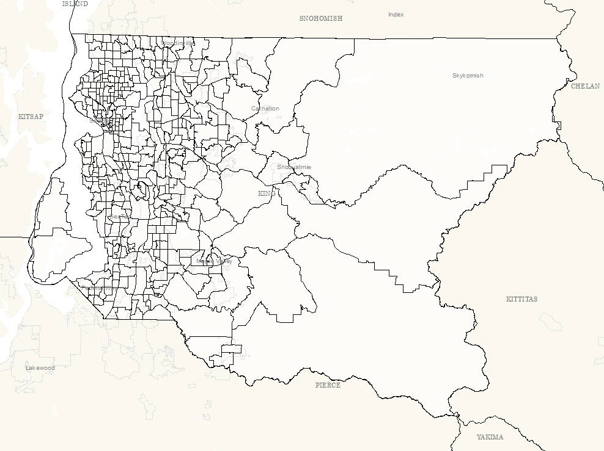
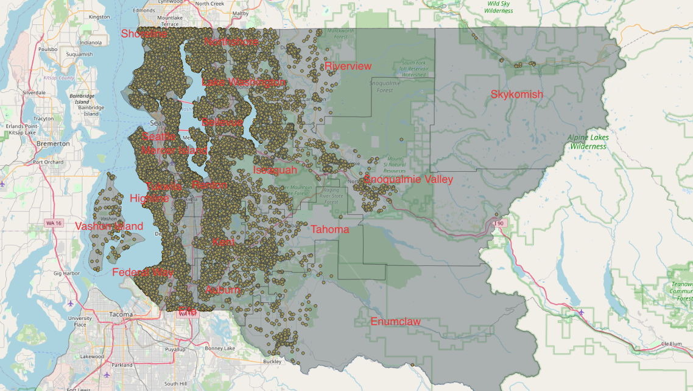
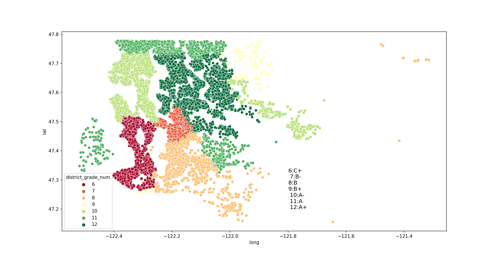
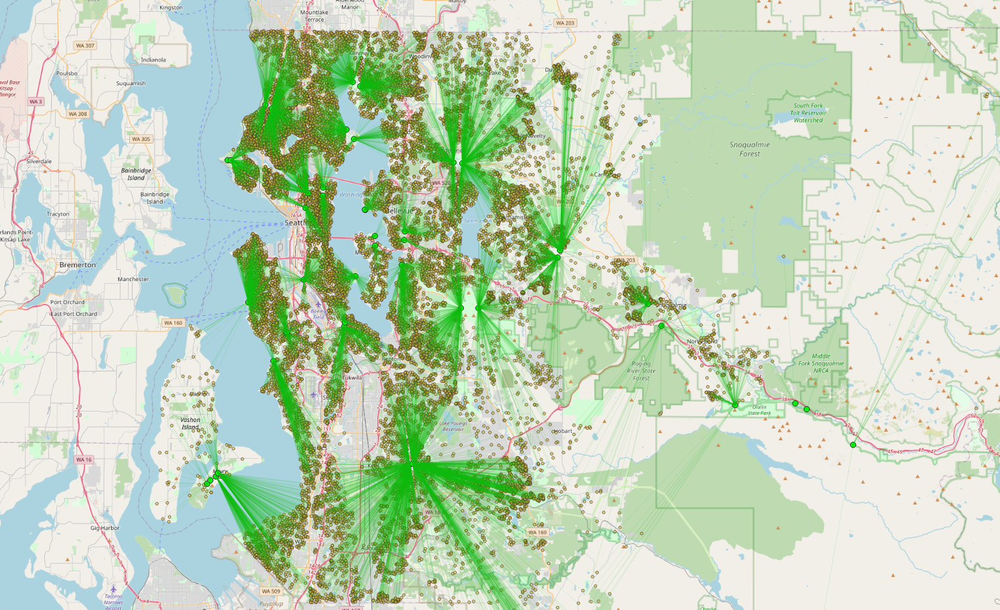
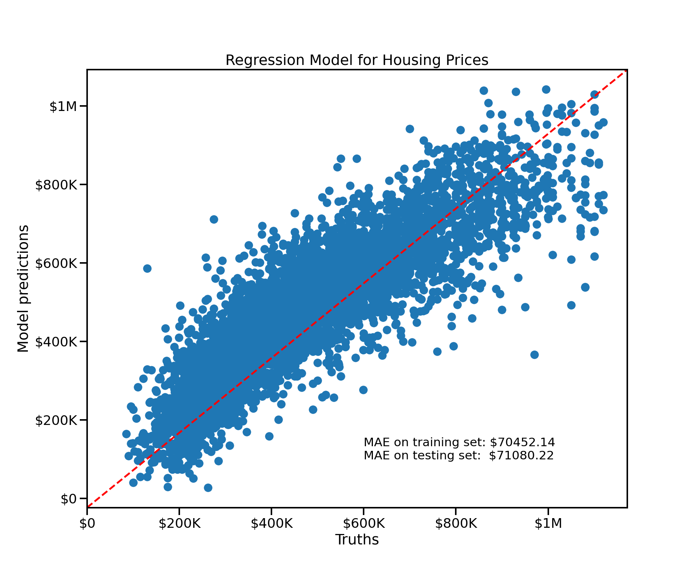
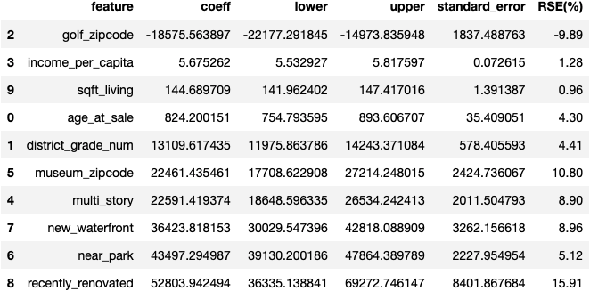
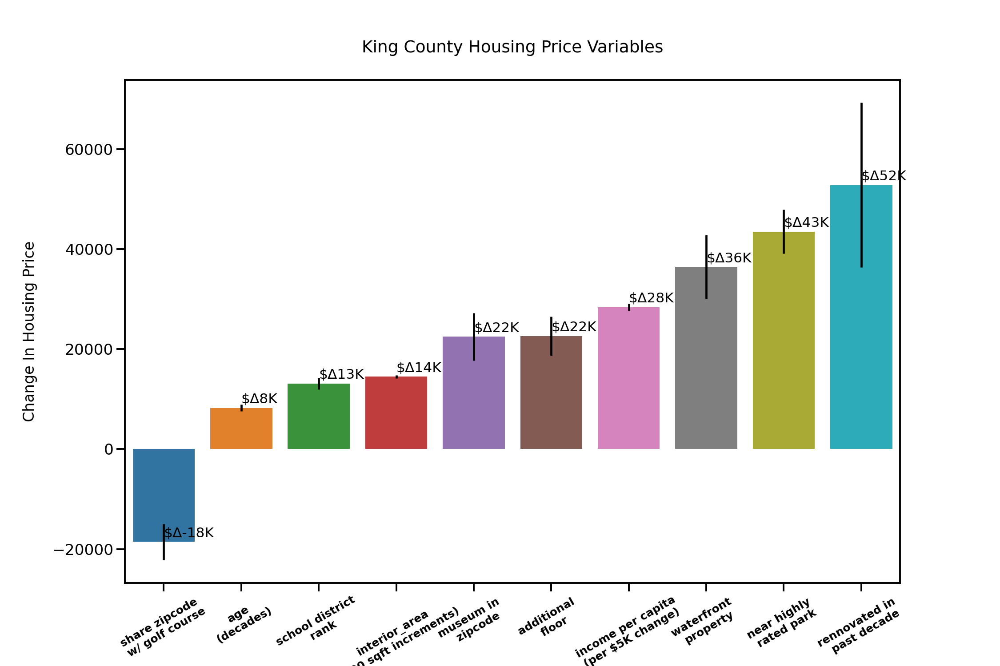

# Modeling King County Housing: Price and Contract Rent 

**Author**: Dylan Dey

## Overview

The **Obtain_Process_Explore** jupyter notebook covers the data obtainment, data scrubbing, and data exploration steps of the OSEMN data science process for modeling King County housing prices using multiple linear regression.

A lot of this notebook covers the obtainment of geospatial data using free, open source QGIS software and open source GIS CSV and shapefiles downloaded from KingCounty.org. This data was combined with data from other sources on the open web in order to create a cohesive set of geodata for King County, WA. 

I have created a blog detailing some of this process here:[Linear Regression Model of King County Housing: Obtaining Geographical Data with Open GIS Software](https://dev.to/ddey117/roughdraft-housing-prices-1o97).

My blog is inspired is an adaptation of this blog by author Juico Bowley: [beginner_QGIS](https://towardsdatascience.com/a-beginners-guide-to-feature-engineering-with-qgis-6147ffaba2eb).

Thank you for the inspiration to explore my old interest of mapping once again in a new field!! 

The **Model_Interpret** jupyter notebook covers the iterative modeling and intepretation of the previously processed King County housing data.

Three final models and the steps that lead to their creation are contained within the notebook. The three final models and their associated goals are:

1) A Predictive Linear Regression Model for King County Housing 

    -Predict housing prices as accurately as possible
___________________________________________________________________________________
    
2) An Interprative Linear Regression Model for King County Housing Prices

    -Determine what features influence King County housing prices and by how much
    
 ___________________________________________________________________________________
    
3) A Predictive Linear Regression Model for King County Contract Rent Prices

    -Predict contract rent prices of housing in King County as accurately as possible


### OSEMN Process

1) Obtain: I have been given a large set of King County housing information, likely downloaded from this Kaggle link:
[King County Housing: Kaggle](https://www.kaggle.com/harlfoxem/housesalesprediction). However, a large portion of this project was spent collecting and processing data to be added to this initial kaggle dataset. 

2) Scrub: Multiple Linear Regression Models require data to meet certain statistical and numerical requirements in order to achieve any substantial results. Therefore, a heavy amount of processing was required for this project, covered in th3e obtainment notebook.

3) Explore: The distrubtion of the data is crucial for linear regression models to function optimally. This is the last section of the OSEMN process that will be covered in the obtainment notebook.

4) Model: Build and refine the models of interest. This is covered in the Model_Interpret notebook. 

5) Interpret: Finally, it is important to actually make sense of the findings given by the newly created models. This will be covered in the same notebook in which the models are built.

### Business Problem
The Seattle Area is a highly sought out area for young adults in technical fields as well as for new families seeking an ideal place to live and raise their children.

My intention is to build a model that can predict housing prices using a handful of variables that would be interesting to new families or individuals moving into King County, WA. I have engineered some features I am certain people would be interested in when considering moving into the area for the first time.

I also intend to create an interpretive model to be able to fully understand the individual contribution of my predictors. Some examples of what I intend to find the full effect of: Per Capita Income, Household Income, School District Rankings, and proximity to museums, parks, and large bodies of natural water. In this way, a family can hand select features as if they were selecting packages on a new or used vehicle, as well as get an understanding of what kind of properties people in the area are buying according to their incomes. Being able to visualize price tags on geological predictors such as these can prove useful to consumers in the housing market.

Finally, I have attempted to include similar models with rent as the target instead of housing prices. Home ownership has become a less obtainable prospect for a large number of families and individuals. Therefore, it would make a lot of sense to create models to predict and interpret the cost of renting properties in the area as well.


## Data

A dataset of Roughly 20,000 homes in King County, WA downloaded from kaggle.com was used as a base DataFrame for this project. This data included a lot of information for the physical features of houses such as Bedrooms, bathrooms, construction quality, living area, lot area, condition, age, floors, basement area, renovations and each properties associated geological coordinates.

*Geological Information*

Although the kaggle dataset included a feature for waterfront properties, after exploring the dataset it seemed that the boolean missed a lot of properties I would consider being waterfront properties. Using QGIS software, shapefiles for bodies of water downloaded from usgs.gov was used in junction with the coordinates of my properties in order to create distance vectors between each house and bodies of water in order to create a new feature of waterfront properties. 

A lot of GIS shapefiles from [kingcount.gov](https://kingcounty.gov) were available to add some more interesting geological features to my model. Through the use of this data, QGIS software, and some information for park ranks and school ranks from various websites, I was able to add the following into my models:


School districts, School district ranks, nearby highly rated parks, museums, golf courses, and the Washington Health Department's aggregate index for health risk factors of census division of King County: the health disparity index. 




More information on this index can be found here:
[Health Disparity Index](https://www.doh.wa.gov/DataandStatisticalReports/WashingtonTrackingNetworkWTN/InformationbyLocation/WashingtonEnvironmentalHealthDisparitiesMap)


*Income Survey Data*

US Census American Community Survey (2014-2018) data of 400 geological tracts: median household income, per capita income, and median contract rent



More information on the GIS data:

[King County Open GIS center](https://gis-kingcounty.opendata.arcgis.com/).

[King County Median Income](https://gis-kingcounty.opendata.arcgis.com/datasets/kingcounty::acs-median-household-income-in-the-past-12-months-in-inflation-adjusted-dollars-acs-b19013-medianhouseholdincome/about).

[per_capita_income](https://gis-kingcounty.opendata.arcgis.com/datasets/kingcounty::acs-per-capita-income-in-the-past-12-months-in-inflation-adjusted-dollars-acs-b19301-percapitaincome/about)

[median rent](https://gis-kingcounty.opendata.arcgis.com/datasets/acs-median-contract-rent-dollars-acs-b25058-mediancontractrent/explore?location=47.431250%2C-121.809050%2C10.40)

[Metadata for School District Shapefile](https://www5.kingcounty.gov/sdc/Metadata.aspx?Layer=schdst)



 


The image below was captured after using the QGIS software to create vectors from each property to the closest park on the list. I then added this data back to the initial dataframe in order to create a new boolean feature: Near Park. I decided to use 4 miles as the cutoff.

Therefore, the new feature will indicate whether the property is within 4 miles of one of these interesting parks.




Zipcodes for museums, golf courses, and stadiums were used to add boolean features to the dataset as well. The source data for this kingcounty.gov. 


### Targets
1) Housing Prices
2) Contract Rent Prices

## Methods

After testing through iterative modeling and data exploration/visualization of the distrubitions of each feature of my complete dataset, I decided to use filtered data in my final models. The problem being solved through the creation of this model is to serve new families or individuals moving to King County, Washington understand what factors affect the price of buying a home and by how much. I believe it is reasonable to filter the data to more realistic expectations for first time home buyers. 

Removing data is not always wise for regression models. The result will still be a fair model as long as it is clear that the data is filtered and it is clear what percent of original data has been removed has been removed.

Below I begain iteratively filtering the data based on three key metrics: The price, squarefoot living, and income per capita. For each metric, I determined the interal quartile region and removed outliers approrpriately. 

The iterative IQR filtering of these three metrics resulted in a loss of data of around 8.5%. The model will still retain reasonable predicitive abilities for over 90% of the data.

After the iterative IQR, I decided to filter for only listings that have less than 8 bedrooms and less than 7 bathrooms in order to make the model easier to interpret. This cutoff also reflects more reasonable houses for the target audience to purchase. 

The total amount of data lost to filtering was 8.60%. The range of homes was roughly $75K to $1.2M after filltering. 

## Results

Three final models were created. 

**1) A Predictive Linear Regression Model for King County Housing **

    -Predict housing prices as accurately as possible
    
    

The model was slightly overfit with the following scores:

Train Score:  0.7796727579611459
Train Mean Absolute Error: 70452.14337001787

Test Score:  0.7722599700234719
Test Mean Absolute Error: 71080.22300422823

This means that th variance in my predictive model can account for 77% of the variance in housing price. The mean absolute error value of about \\$71,000 can be used as a estimation for the percision of my predictions. The absolute value of the error seems high but that is largely due to the scale of housing prices. 

The model seems to obey all of the assumptions for linear regression other than high multicolinearity. The QQ plot revealed a right skew again, but not too dramatic. The plot of residuals for homoscedasticity did not uncover any major violations.  


I also ended up creating a crude input function in order to play around with inputing values for all dependent variables and spitting out a housing price range. 
    
___________________________________________________________________________________
    
**2) An Interprative Linear Regression Model for King County Housing Prices**

    -Determine what features influence King County housing prices and by how much
    
    

Scaled Train Score: 0.7330522611954744 Scaled Train Mean Absolute Error: 77618.06895051948

Scaled Test Score: 0.7092551034195105 Scaled Test Mean Absolute Error: 80050.90880042624

Unscaled Train Score: 0.7231071751779209 Unscaled Train Mean Absolute Error: 79383.95693472768

Unscaled Test Score: 0.7181326942515609 Unscaled Test Mean Absolute Error: 79248.99238828976

My unscaled model is much more overfit than my unscaled model. The scaled model can explain about 71% of the variance in the test data as compared to 73% of the training data and 72% in the unscaled testing model. As usual there is a skew in the distrubtion of the preds, although not super dramatic. The scatter plot of residuals seem to indicate homoscedasticity. All of the VIF scores have fallen within my acceptable range for multicolinearity.

Looking at just the scores and errors, it would seem the the unscaled model performs better and is clearly less overfit than the scaled data. However, the model with the scaled data has a dramatically lower condition score and much less multicolinearity issues. It also contains more interesting features and lower standard errors for each coefficient, which is what I really care about for an interpretive model.

I decided to select the scaled model as my final intreptive model because of the lesser impact of multicolinearity when intepreting coeeficients. I also believe it to be more interesting when trying to answer my buisness problem.

A table with each feature, its related coefficient (the description of how one unit change in the feature changes the price of houses), and the values that define the lower and upper boundaries of the 95% confidence interval for each associated coefficient. 

There is a 5% chance that the values that describe the relationships between each feature and the price of KC housing falls outside of the given lower and upper bounds of the confidence interval for each coefficient. 



The standard error for each coefficient gives us an idea of the statistical precision of our coefficient values and are used to calculate confidence intervals. The smaller the standard error, the narrower the confidence intervals, and the more precise the values for the coefficients. In order to compare the precisions relative to one another, relative standard error can be used. The graph explains how about two times the standard error in each direction can be used to define an interval in which we can be 95% confident that the true value is within the range. This can be done because of the assumption of normality for our residuals. 

The relative standard error (RSE) in this context describes the standard error of each coefficient divided by their associated coefficient values. This calculation is then multiplied by 100 in order to describe this statistic as a perctange. 

The coefficient that describes the change price relative to the change in the square footage of the living interior of the home (sqft_living in the table) has the lowest RSE of the bunch (0.96%). Therefore, the confidence interval is the tightest. It is even relatively more precise than the income_per_capita feature. This would have been hard to determine without the RSE value because all of the features are on different scales. 

The income per capita feature is the second most precise feature with a RSE if 1.28%. 

The coefficient for rennovating a house has the highest relative and absolute standard error. Therefore, it has the widest and least precise coefficient of the bunch. 

###### intepretation 

There is a 5% chance that the following statements are false for King County Housing according to my model:

An increase in 1 square footage of living space equates to an increase of housing price between about \\$142 and \\$147.50. 

Each year you own a home in King County, the value increases by about \\$755 to \\$900.

Moving from one school district grade to another (ie moving from a school district with a B+ rating to a school district with an A- rating) will equate to change in housing price between about \\$12,000 and \\$14,000 if all other factors are held constant. This means if you want to choose between the exact same house located in either the lowest rated school district in King County or the highest rated school district in King County would mean the diference of about \\$80,000! Think of the savings!! Or well, the kids. 

If you want to select a home near a top rated park, expect to pay an extra \\$39,000 to \\$48,000.

Choosing between a one story or multi-story home means a difference between about \\$18,500 and \\$26,500.

If you want to select a waterfront property, expect to pay an extra \\$30,500 and \\$43,000.

Settling on a home near a golf course actually may save you between \\$15,000 and \\$22,000. Just watch out for those sliced shots. 

Selecting a house in the same zipcode as a museum in King County will add between about \\$18,000 and \\$27,000 to the total cost of the home. 


    
 ___________________________________________________________________________________
    
**3) A Predictive Linear Regression Model for King County Contract Rent Prices**

This is my weakest model. 

Train Score: 0.5836960366808019 Train Mean Absolute Error: 163.21287121452102

Test Score: 0.5821658335321243 Test Mean Absolute Error: 163.67073938729447

The model is slightly overfit. The resdiuals appear to satisfy the normality assumption. The mean absolute error between the test and train sets are very similar. About 58% of the variance in rent is explained by the variance of this model.

[rental price predictions](images/rental_price_predictions.png)

## Conclusions

Adding in a lot of GIS related features helped to build fairly decent and interesting linear regression models for King County, WA housing prices. 

Future work: improve the predicitive linear regression model for rental prices. Create a interpretive model for rental prices. 

## For More Information

Please review our full analysis in [Jupyter Notebook](./dsc-phase1-project-template.ipynb) or our [presentation](./DS_Project_Presentation.pdf).

For any additional questions, please contact **name & email, name & email**

## For More Information

Please review our full analysis in [Data Obtainment Jupyter Notebook](./Obtain_Process_Explore.ipynb) and [Modeling Jupyter Notebook](Obtain_Process_Explore.ipynb) or in [Model Presentation](./King_County_Housing_Presentation.pdf)

For any additional questions, please contact **Dylan Dey, ddey2985@gmail.com

## Repository Structure

Describe the structure of your repository and its contents, for example:

```
├── README.md                             <- The top-level README for reviewers of this project
├── Obtain_Process_Explore.ipynb          <- Narrative documentation of data obtainment and processing in Jupyter notebook
├── Model_Interpret.ipynb                 <- Narrative documentation of iterative modeling and interpretation in Jupyter notebook
├── King_County_Housing_Presentation.pdf  <- PDF version of project presentation                          
├── data                                  <- externally sourced and internally through code
└── images                                <- externally sourced and internally through code
```
